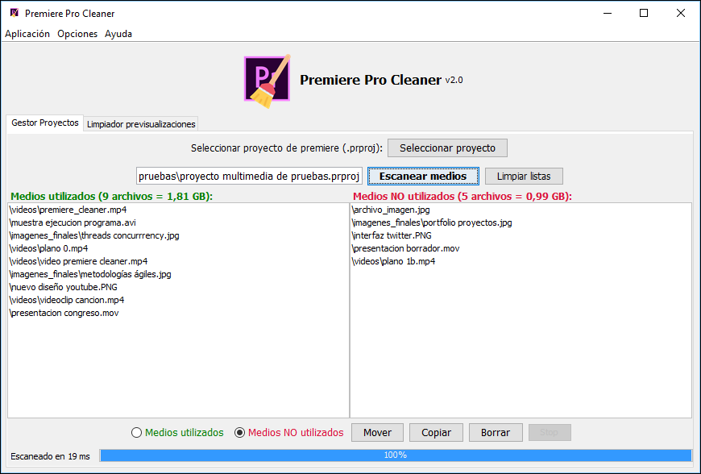
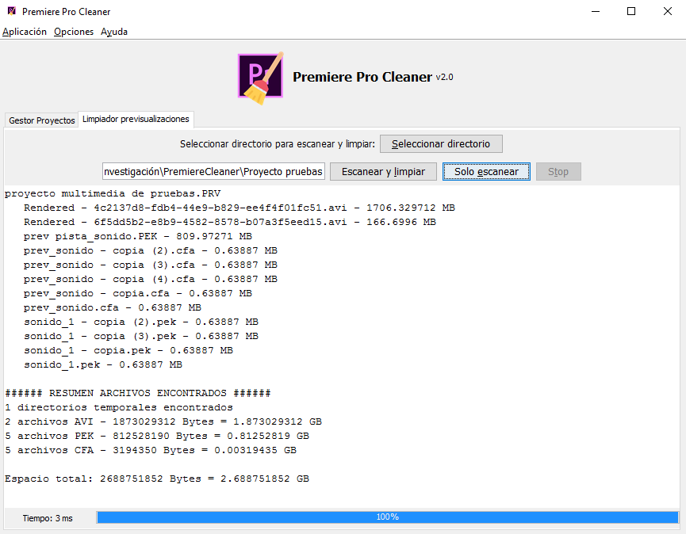
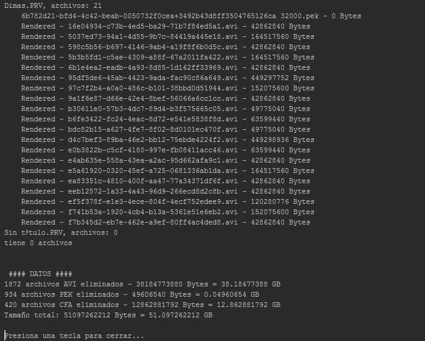

# Premiere Pro Cleaner

Clean the Adobre Premiere Pro Projects before backuping or moving it anywhere deleting unnecessary preview files, and audio / video renders for real time editing: .CFA, .PEK, .AVI.

* <b>Move</b> or <b>copy</b> the used/unused media files to another folder and save only the files that the project needs.
* <b>Delete</b> the used/unused media files.

Program tested for CS4, CS5 and CS6 version. <b>Desktop aplication (v2)</b>, developed in Java.

<b>Project manager</b> tab:

<b>Real example</b>, used in a production of a TV serie chapter that last 30 minutes:
Adobe proyect <b>size before</b> using the cleaner <b>110 GB</b>, and <b>after</b>: <b>45 GB</b>

<b>Preview cleaner</b> tab:

<b>Python</b> program screenshot:

<small>Premiere Pro logo by Adobe and Broom icon by <a href="http://www.flaticon.com/authors/nikita-golubev">nikita golubev</a>.</small>
